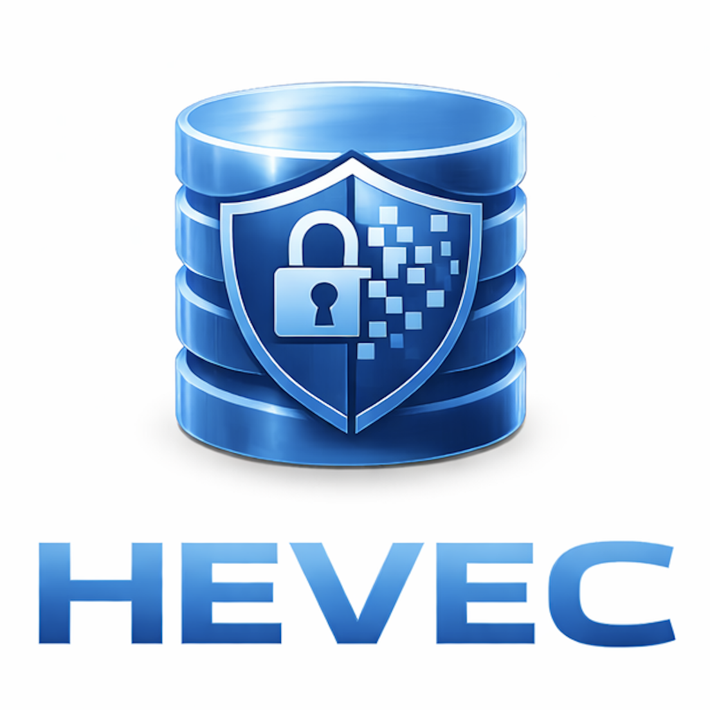

<p align="center">
  
</p>

<h1 align="center">HEVEC</h1>

<p align="center">
  <b>Homomorphically Encrypted Vector Database</b><br/>
  Real-time similarity search over encrypted vectors — without ever decrypting data or queries.
</p>

<p align="center">
  <a href="https://github.com/cloneisyou/hevec/stargazers">
    
  </a>
  <a href="https://github.com/cloneisyou/hevec/blob/main/LICENSE">
    
  </a>
  <a href="https://arxiv.org/abs/2506.17336">
    
  </a>
  
  
  
</p>

---

## What is HEVEC?

**HEVEC** is a vector database built on **homomorphic encryption (HE)** that enables:

- 🔐 **End-to-end encrypted similarity search**
- 🚫 **No plaintext data, no plaintext queries — ever**
- ⚡ **Real-time performance at million-scale**

Unlike conventional vector databases, **HEVEC performs similarity search directly on encrypted vectors**, ensuring that neither the server nor the infrastructure provider can see user data or queries.

---

## Why HEVEC exists

Modern AI systems — especially **personal AI agents and copilots** — rely on deeply personal embeddings:
screen history, memories, preferences, private documents.

This creates a fundamental privacy bottleneck:

> Vector databases require plaintext embeddings to work.

**HEVEC removes this bottleneck.**

It allows personal AI agents (e.g., OpenClaw-style copilots, long-term memory systems) to retrieve relevant context **without ever decrypting data on the server side**.

---

## Key Capabilities

### 🔐 End-to-End Encrypted Search
- Queries remain **MLWE-encrypted** throughout the entire client ↔ server lifecycle
- Only the client holds the secret key
- Server never sees plaintext vectors, queries, or scores

### ⚡ Real-Time at Scale
- Demonstrated **~1M encrypted vectors in ~187 ms**
- No trusted hardware, no secure enclaves required

### 🧠 Built for Personal AI Agents
- Designed as a core privacy layer for long-term multimodal memory
- Already used in real systems (e.g., **Clone** memory assistant)

---


## Quick Start

### Python

```python
import numpy as np
from hevec_py import (
    Client, Server, SecretKey, SwitchingKey,
    AutedModPackKeys, AutedModPackMLWEKeys,
    MLWECiphertext, Message, CachedQuery, CachedKeys, Ciphertext,
)

LOG_RANK = 7
RANK     = 2 ** LOG_RANK   # 128-dim vectors
DEGREE   = 4096
LOG_SCALE = 26.25
scale    = 2.0 ** LOG_SCALE

# 1. Key generation (client-side only)
client  = Client(LOG_RANK)
sec_key = SecretKey()
relin_key = SwitchingKey()
amp_keys  = AutedModPackKeys(RANK)
amp_mlwe  = AutedModPackMLWEKeys(RANK)

client.gen_sec_key(sec_key)
client.gen_relin_key(relin_key, sec_key)
client.gen_auted_mod_pack_keys(amp_keys, sec_key)
client.gen_inv_auted_mod_pack_keys(amp_mlwe, sec_key)

# 2. Encrypt a query vector
query_data = np.random.randn(RANK).astype(np.float64)
query_data /= np.linalg.norm(query_data)

query_msg = Message(RANK)
for i in range(RANK):
    query_msg[i] = query_data[i]

query_ct = MLWECiphertext(RANK)
client.encrypt_query(query_ct, query_msg, sec_key, scale)

# 3. Encrypt database vectors (one per slot, up to DEGREE vectors)
db = np.random.randn(DEGREE, RANK).astype(np.float64)
db /= np.linalg.norm(db, axis=1, keepdims=True)

mlwe_keys = []
for i in range(DEGREE):
    msg = Message(RANK)
    for j in range(RANK):
        msg[j] = db[i, j]
    ct = MLWECiphertext(RANK)
    client.encrypt_key(ct, msg, sec_key, scale)
    mlwe_keys.append(ct)

# 4. Server computes encrypted inner product (no secret key needed)
server = Server(LOG_RANK, relin_key, amp_keys, amp_mlwe)

qcache = CachedQuery(RANK);  server.cache_query(qcache, query_ct)
kcache = CachedKeys(RANK);   server.cache_keys(kcache, mlwe_keys)

result_ct = Ciphertext()
server.inner_product(result_ct, qcache, kcache)

# 5. Decrypt scores (client-side only)
scores = Message(DEGREE)
client.decrypt(scores, result_ct, sec_key, 2.0 ** (2 * LOG_SCALE))

print("Top-5 indices:", np.argsort([-scores[i] for i in range(DEGREE)])[:5])
```

### Node.js

```typescript
import {
  Client, Server, SecretKey, SwitchingKey,
  AutedModPackKeys, AutedModPackMLWEKeys,
  MLWECiphertext, Message, CachedQuery, CachedKeys, Ciphertext,
} from 'hevec_node';

const LOG_RANK  = 7;
const RANK      = 2 ** LOG_RANK;
const DEGREE    = 4096;
const LOG_SCALE = 26.25;
const scale     = 2 ** LOG_SCALE;

// 1. Key generation
const client   = new Client(LOG_RANK);
const secKey   = new SecretKey();
const relinKey = new SwitchingKey();
const ampKeys  = new AutedModPackKeys(RANK);
const ampMlwe  = new AutedModPackMLWEKeys(RANK);

client.genSecKey(secKey);
client.genRelinKey(relinKey, secKey);
client.genAutedModPackKeys(ampKeys, secKey);
client.genInvAutedModPackKeys(ampMlwe, secKey);

// 2. Encrypt query
const queryMsg = new Message(RANK);
for (let i = 0; i < RANK; i++) queryMsg.set(i, Math.random() - 0.5);
const queryCt = new MLWECiphertext(RANK);
client.encryptQuery(queryCt, queryMsg, secKey, scale);

// 3. Server-side inner product (secret key is never sent)
const server = new Server(LOG_RANK, relinKey, ampKeys, ampMlwe);
const qcache = new CachedQuery(RANK);
server.cacheQuery(qcache, queryCt);

// ... encrypt & cache database vectors, then:
// const result = new Ciphertext();
// server.innerProduct(result, qcache, kcache);

// 4. Decrypt on client
// const scores = new Message(DEGREE);
// client.decrypt(scores, result, secKey, 2 ** (2 * LOG_SCALE));
```

> See `server/example/ex0_ip.py` for the complete runnable version.

## Architecture

```mermaid
flowchart LR
    subgraph Client
        A[Keygen<br/>SecretKey / SwitchingKey]
        B[Encrypt query
        (MLWE)]
        C[Decrypt scores]
    end

    subgraph Server
        D[HEVEC Server<br/>C++20 + HEXL]
        E[Vector Collections<br/>HE-friendly layout]
    end

    A --> B
    B -->|encrypted query| D
    E --> D
    D -->|encrypted scores| C
```

## Security Model

HEVEC follows a **client-holds-secret** design. The server never sees plaintext data.

| Aspect | Client | Server |
|--------|--------|--------|
| Secret key | Holds `SecretKey` | Never receives it |
| Query vector | Encrypts before sending | Sees only MLWE ciphertext |
| Database vectors | Encrypts before upload | Stores only ciphertexts |
| Similarity scores | Decrypts after receiving | Computes on ciphertexts; cannot read scores |
| Payloads | Decrypts after retrieval | With PIR: cannot learn which index was accessed |

**What the server cannot learn:**
- The plaintext query vector
- Individual similarity scores or their ranking
- Which payload was retrieved (when using PIR mode)

The cryptographic foundation is MLWE (Module Learning With Errors), a lattice-based scheme that is conjectured to be post-quantum secure.

## Project Structure

```
HEVEC/
├── server/                  # Core C++ library + Python binding
│   ├── src/                 # C++ implementation
│   │   ├── Client.cpp       #   Low-level HE client operations
│   │   ├── Server.cpp       #   Low-level HE server operations
│   │   ├── HEVECClient.cpp  #   High-level HTTP client (collection API)
│   │   ├── HEVECServer.cpp  #   HTTP server (Beast)
│   │   ├── HEval.cpp        #   Homomorphic evaluation kernels
│   │   ├── SecretKey.cpp     #   Key generation
│   │   ├── PIRServer.cpp    #   Private Information Retrieval
│   │   └── Random.cpp       #   Cryptographic RNG
│   ├── include/HEVEC/       # Public C++ headers
│   ├── python/bindings.cpp  # pybind11 → hevec_py module
│   ├── example/             # Python examples (ex0–ex3)
│   ├── run_server.py        # Standalone server launcher
│   ├── conda/               # Conda environment spec
│   └── CMakeLists.txt
├── client/                  # Language-specific client bindings
│   ├── src/                 # C++ client (mirrors server/src for client-only builds)
│   ├── node/                # Node.js / Electron N-API addon
│   │   ├── addon.cpp        #   N-API C++ binding
│   │   ├── index.ts         #   TypeScript entry point
│   │   └── types.d.ts       #   TypeScript type declarations
│   └── CMakeLists.txt
├── pyproject.toml           # Python package metadata
├── LICENSE                  # MIT
└── README.md
```

## Requirements

- CMake ≥ 3.21, C++20 toolchain with OpenMP and OpenSSL dev headers (clang‑17/llvm from `server/conda/HEVEC-dev.yml` is known-good)
- Python 3.10+ for bindings and examples
- Node.js 20+ if building the N-API addon (`client/node`)
- Git network access (CMake fetches Intel HEXL when `BUILD_HEXL=ON`, default)

You can reproduce the tested toolchain via Conda:

```bash
conda env create -f server/conda/HEVEC-dev.yml
conda activate HEVEC-dev
```

## Build & Install

### Core library + Python binding

```bash
cd server
cmake -S . -B build -DBUILD_PYTHON=ON
cmake --build build --config Release
# Optionally install the pybind module in editable mode
pip install -e .
```

### Node.js binding (optional)

```bash
cd client/node
npm install
npm run build:hevec-native
```

### (Optional) TCP transport (legacy-compatible)

The default transport is HTTP/Beast. TCP support now lives in the main tree (no separate `legacy_for_tcp/`). Enable it only if you need the older socket protocol:

```bash
cd server
cmake -S . -B build -DBUILD_TCP_BACKEND=ON
cmake --build build --config Release
```
Use the `HEVECClientTCP` and `HEVECServerTCP` classes from `HEVEC/HEVECClientTCP.hpp` and `HEVEC/HEVECServerTCP.hpp` respectively.

### Build options (CMake)

| Option               | Default | Description |
|----------------------|---------|-------------|
| `BUILD_PYTHON`       | OFF     | Build Python bindings (`hevec_py`). |
| `BUILD_NODE`         | OFF     | Build Node/Electron addon (`hevec_node`). |
| `BUILD_TCP_BACKEND`  | OFF     | Include legacy TCP client/server classes. |
| `BUILD_HEXL`         | ON      | Fetch/build Intel HEXL; set OFF to link a system copy. |

## API Reference

### Python (`hevec_py`)

#### Low-level API — `Client` / `Server`

| Class | Method | Description |
|-------|--------|-------------|
| `Client(log_rank)` | | Create a client with vector dimension `2^log_rank` |
| | `gen_sec_key(sk)` | Generate a secret key |
| | `gen_relin_key(rk, sk)` | Generate a relinearization key |
| | `gen_auted_mod_pack_keys(keys, sk)` | Generate automorphism packing keys |
| | `gen_inv_auted_mod_pack_keys(keys, sk)` | Generate inverse automorphism keys |
| | `encrypt_query(ct, msg, sk, scale)` | Encrypt a query vector into MLWE ciphertext |
| | `encrypt_key(ct, msg, sk, scale)` | Encrypt a database vector into MLWE ciphertext |
| | `decrypt(msg, ct, sk, scale)` | Decrypt a ciphertext into a message |
| | `decrypt_score(msgs, cts, sk, scale)` | Batch-decrypt score ciphertexts |
| | `top_k_score(topk, msgs)` | Extract top-k indices from decrypted messages |
| `Server(log_rank, rk, amp, amp_mlwe)` | | Create a server with evaluation keys (no secret key) |
| | `cache_query(cache, query)` | Pre-process encrypted query for fast evaluation |
| | `cache_keys(cache, keys)` | Pre-process encrypted database vectors |
| | `inner_product(res, q_cache, k_cache)` | Compute encrypted inner products |

#### High-level API — `HEVECClient` / `HEVECServer`

| Class | Method | Description |
|-------|--------|-------------|
| `HEVECClient(host, port)` | | Connect to a running HEVEC server |
| | `setup_collection(name, dim, metric, is_query_encrypt=True)` | Create a collection (`metric`: `MetricType.IP`, `.L2`, `.COSINE`) |
| | `drop_collection(name)` | Delete a collection |
| | `insert(name, db, payloads)` | Insert vectors (`np.ndarray`) with string payloads |
| | `query(name, vec)` | Encrypted query; returns decrypted scores |
| | `query_and_top_k(topk, name, vec)` | Query and write top-k indices into `TopK` |
| | `query_and_top_k_with_scores(name, vec, k)` | Returns list of `(index, score)` tuples |
| | `retrieve(name, index)` | Fetch payload by index (plaintext) |
| | `retrieve_pir(name, index)` | Fetch payload by index via PIR (private) |
| | `get_top_k_indices(scores, k)` | *Static.* Return top-k indices from a score array |
| | `terminate()` | Shut down the remote server |
| `HEVECServer(port)` | | Launch an HTTP server |
| | `run()` | Start listening (blocking) |

#### Constants

| Name | Value | Description |
|------|-------|-------------|
| `DEGREE` | 4096 | Polynomial ring degree (N) |
| `LOG_RANK` | 7 | Log₂ of the MLWE rank (vector dimension = 128) |
| `LOG_SCALE` | 26.25 | Encoding scale (bits of precision) |
| `MetricType.IP` | — | Inner product similarity |
| `MetricType.L2` | — | Euclidean distance |
| `MetricType.COSINE` | — | Cosine similarity |

### Node.js (`hevec_node`)

The Node.js binding mirrors the Python API with camelCase naming:

| Python | Node.js |
|--------|---------|
| `client.gen_sec_key(sk)` | `client.genSecKey(sk)` |
| `client.encrypt_query(ct, msg, sk, s)` | `client.encryptQuery(ct, msg, sk, s)` |
| `server.inner_product(res, qc, kc)` | `server.innerProduct(res, qc, kc)` |
| `hevec_client.setup_collection(...)` | `hevecClient.setupCollection(...)` |
| `hevec_client.query_and_top_k_with_scores(...)` | `hevecClient.queryAndTopKWithScores(...)` |
| `hevec_client.retrieve_pir(name, idx)` | `hevecClient.retrievePIR(name, idx)` |

See `client/node/types.d.ts` for full TypeScript type declarations.

## Run the server

Start the standalone server on port 9000:

```bash
cd server
python run_server.py 9000
```

The server exposes the HEVEC protocol used by the client examples below.

### Defaults and environment
- Default port: `9000`
- AES key path (optional, TCP PIR payload encryption): set `HEVEC_AES_KEY_PATH` to load/save AES key.
- Client log file (optional): set `HEVEC_CLIENT_LOG_PATH` to append client-side timings.

## Examples

All scripts live under `server/example/`. Ensure the server is running (`python run_server.py 9000`) when an example uses `HEVECClient`.

- `ex0_ip.py` — Pure HE inner-product sanity check; no server required. Run: `python server/example/ex0_ip.py`.
- `ex1_deep1m.py <base.fbin> <query.fbin>` — Encrypted search over Deep1M FBIN files. Truncates to 1M base / 10k queries by default.
- `ex2_laion.py <img_emb.npy> <text_emb.npy>` — Cross-modal LAION evaluation using precomputed embeddings (100k/1k default subset).
- `ex3_locomo.py --qa_json <qa.json> --memory_db_root <dense_db_dir>` — Locomo QA retrieval; loads plaintext vectors from `memory_db_root`, inserts into HEVEC, compares encrypted vs. plaintext scores. Requires the NVIDIA Dragon encoder (downloads via `transformers`).

Data is not bundled. Use the paths in each example's usage string and supply your own embeddings/FBIN files. GPU is recommended for `ex3_locomo.py` due to transformer inference.

## Citation

```
@article{bae2025privacy,
  title={Privacy-Preserving LLM Interaction with Socratic Chain-of-Thought Reasoning and Homomorphically Encrypted Vector Databases},
  author={Bae, Yubeen and Kim, Minchan and Lee, Jaejin and Kim, Sangbum and Kim, Jaehyung and Choi, Yejin and Mireshghallah, Niloofar},
  journal={arXiv preprint arXiv:2506.17336},
  year={2025}
}
```